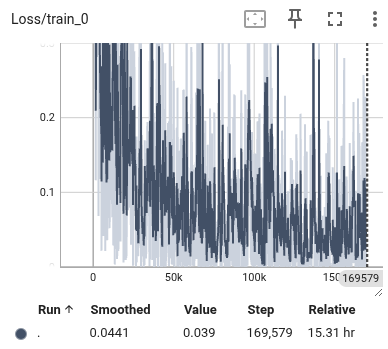

## 2026.5.27

valid分数随epoch数变化

* m1: 0.9446680080482898, 0.9195171026156942, 0.693158953722334, 0.7142857142857143, 0.8128772635814889
* m2: 0.7907444668008048, 0.9104627766599598, 0.739436619718309, 0.8128772635814889, 0.5925553319919518
* m3: 0.6046277665995976, 0.9567404426559356, 0.970824949698189, 0.7374245472837022, 0.9828973843058351

重点： 

* e1的时候至少拿到0.6以上的分数，不然认定为实现错误
* 分数浮动比较大，感觉以前不是这样的……是引入了什么不稳定因素么

loss:

重点：

* 微调到epoch 2～3的时候开始收敛